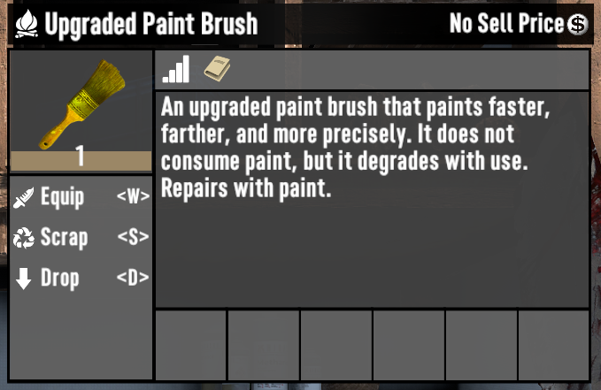

# ISI Upgraded Paint Brush

A 7 Days to Die (7D2D) mod that adds a new paint brush that degrades with use instead of consuming paint. Can be repaired with paint.

## Upgraded Paint Brush

The new paint brush unlocks as you paint (erasing does not count). Higher quality (more durable) brushes unlock as you continue to paint. A quality level 6 the brush stops degrading.

